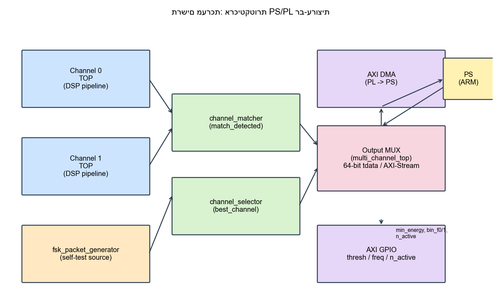
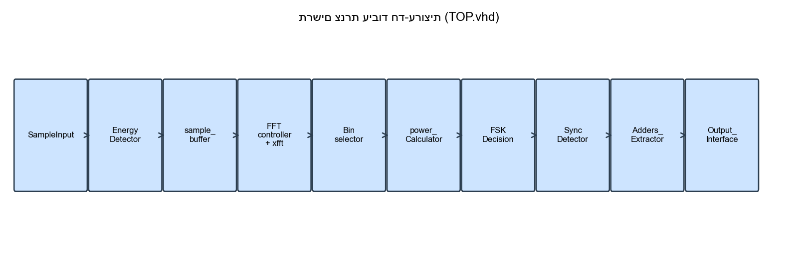
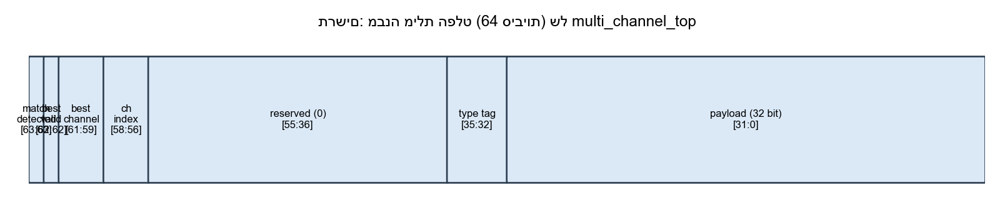

# Multi-Channel FSK Signal Detection and Address Decoder (PYNQ-Z2)

A real-time, multi-channel FSK receiver implemented on a PYNQ-Z2 (Zynq-7020), built as a final
engineering project (B.Sc. Electrical & Electronics Engineering, Ariel University, 2026).
**Final grade: 89.**

The system detects FSK signal activity, performs FFT-based frequency analysis, demodulates bits,
finds frame sync, extracts a destination address, compares addresses across channels, and picks
the most confident channel — all on the FPGA fabric (PL), streamed to the ARM CPU (PS) over AXI
DMA for real-time visualization in Jupyter.

Full technical writeup: [`Project_Book_FSK_Multichannel.pdf`](Project_Book_FSK_Multichannel.pdf)
(Hebrew).

---

## 📡 Overview

The design follows a hardware/software co-design approach:
- **FPGA (PL)** — two parallel DSP pipelines (energy detection → FFT → power → FSK decision →
  sync → address extraction), plus cross-channel address matching and best-channel selection.
- **CPU (PS)** — reads the combined AXI-Stream output via AXI DMA, decodes it, and renders a
  live multi-channel monitor in a Jupyter notebook.

The project was developed incrementally: a single-channel pipeline was built and verified first
(`hw/rtl/TOP.vhd`), then replicated into a parameterized multi-channel design
(`hw/rtl/multi_channel_top.vhd`) with added cross-channel comparison and output arbitration.
Both stages are preserved in `sw/single_channel/` and `sw/multi_channel/`.

---

## ✅ Verified Results

| Metric | Result |
|---|---|
| Channels implemented & tested | 2 (`N_channel` generic, parameterized for more) |
| Timing closure — WNS | **+0.485 ns** (positive, no setup violations) |
| Timing closure — WHS | **+0.020 ns** (positive, no hold violations) |
| Failing endpoints (TNS/THS) | 0 / 0 |
| Live visualization rate | **~10 FPS** (wall-clock throttled, decoupled from packet rate) |
| Hardware validation | PYNQ-Z2 (XC7Z020-1CLG400C) @ 100 MHz, bitstream loaded and run live |
| LUT / Register / BRAM / DSP utilization | 14.2% / 10.1% / 4.3% / 12.7% (`design_1_wrapper`, post place & route) |

These numbers are reported by Vivado 2019.1's routed design timing summary and utilization
report, and are documented in full in the project book (Ch. 7–8).

---

## ⚙️ Current Implementation

Both the single-channel and multi-channel pipelines are implemented, simulated, and validated
on real PYNQ-Z2 hardware:

- Sample input buffering, per-channel
- Energy detection (gates FFT activity to save power/avoid noise)
- FFT-based frequency analysis (Xilinx LogiCORE FFT IP, 256-point)
- Frequency bin selection and power calculation
- FSK bit decision
- Sync detection (16-bit correlation, shift register)
- Address extraction (7-bit field)
- **Multi-channel replication** of the pipeline above (`multi_channel_top`, generic `N_channel`)
- **Cross-channel address matching** (`channel_matcher` → `match_detected`)
- **Best-channel selection** by power margin (`channel_selector` → `best_channel`/`best_valid`)
- Round-robin output multiplexing into a single 64-bit AXI-Stream word
- AXI DMA transfer of the combined stream to the PS
- Internal FSK packet generator (`fsk_packet_generator`) for self-test without external RF
  hardware — synthesizes tones, sync words, addresses, and inter-packet noise
- Runtime-adjustable energy threshold, FSK bin indices, and active channel count via AXI-GPIO
- Python/PYNQ software that reads the AXI DMA stream and renders a live per-channel monitor
  (rolling power history, current-window power bars, address log, match/best-channel banner)

✔ Full pipeline verified in simulation (behavioral testbench, `tests/TB/TB_FSKgenerator.vhd`)
✔ Design closes timing and has been synthesized, implemented, and bitstreamed in Vivado 2019.1
✔ Bitstream loaded and run live on PYNQ-Z2 hardware, with continuous DMA streaming and no
  timeouts observed
✔ Cross-channel address match (`match_detected=1`) and independent per-channel address
  divergence both verified on hardware, matching the self-test generator's design
✔ Real-time Python visualization confirmed working at ~10 FPS

---

## 🚀 Planned Extensions

Not yet implemented — candidates for future work (see project book Ch. 9.3):

- Scale beyond 2 channels (`N_channel > 2`) and re-verify timing/utilization at that scale
- Replace the internal packet generator with a real external RF front-end / ADC input, for
  validation against real-world signal conditions
- Timestamp-based cross-channel address matching (current matcher compares the *last latched*
  address per channel, not a time-windowed match)
- Moving-average channel selection (current selector uses a single-window power margin, so it
  can be sensitive to a noisy instantaneous reading)
- Formal performance evaluation: Probability of Detection (Pd), False Alarm Rate (Pfa), Bit
  Error Rate (BER) under varying SNR
- Support for a richer frame format (e.g. variable-length payload, CRC)
- Measured power consumption on PYNQ-Z2 under sustained operation

---

## 🔁 System Pipeline (per channel)

```
Input Samples
  ↓
Energy Detection
  ↓
FFT Processing (256-point)
  ↓
Frequency Bin Selection
  ↓
Power Calculation
  ↓
FSK Decision
  ↓
Sync Detection
  ↓
Address Extraction
  ↓
Output_Interface (36-bit AXI-Stream)
```

Two (or more) instances of the pipeline above feed into the multi-channel layer:

```
Channel 0 (TOP)  ──┐
                    ├─→ channel_matcher  (match_detected)
Channel 1 (TOP)  ──┤
                    ├─→ channel_selector (best_channel / best_valid)
fsk_packet_generator│
 (self-test source)└─→ Output MUX (multi_channel_top) ─→ AXI DMA ─→ PS
```




---

## 🧠 System Architecture

### FPGA (PL)
- Two (or more) fully pipelined real-time DSP chains — one per channel
- Cross-channel address matching and best-channel selection
- Round-robin output multiplexing into a single AXI-Stream
- Internal self-test signal source (no external RF hardware required)
- Runtime-configurable thresholds/parameters via AXI-GPIO

### CPU (PS)
- Data acquisition via AXI DMA
- Parsing of the combined FPGA output stream
- Per-channel state tracking (power history, sync count, address log)
- Real-time visualization (Python/Matplotlib in Jupyter, PNG-rendered, ~10 FPS)

---

## 📤 Output Interface

The FPGA outputs a single AXI-Stream word per beat (`tdata`, `tvalid`, `tready`, `tlast`).
The multi-channel output word is 64 bits wide:



| Bits | Field | Meaning |
|---|---|---|
| `[63]` | `match_detected` | Sticky flag — two channels extracted the same address |
| `[62]` | `best_valid` | `best_channel` is meaningful |
| `[61:59]` | `best_channel` | Channel with the largest \|P0−P1\| power margin |
| `[58:56]` | `ch_index` | Which channel this word originated from |
| `[55:36]` | reserved | Zero |
| `[35:32]` | type tag | `0001`=power0, `0010`=power1, `0011`=sync, `0100`=address |
| `[31:0]` | payload | Power value, sync flag, or extracted address (7 bits) |

power0/power1 arrive as a 2-word packet (`tlast` on power1); sync and address packets are single
words.

---

## 🧪 Software (Python)

`sw/` contains two generations of the runtime, reflecting the incremental development approach:

- **`sw/single_channel/`** — the original single-channel bring-up scripts.
  - `run_fpga.py` — loads the bitstream, reads one AXI DMA channel, and plots power comparison.
  - `simulation.py` — despite the name, this also drives real hardware over AXI DMA (it is
    functionally a near-duplicate of `run_fpga.py` from the same development stage); it does
    **not** simulate FPGA output offline.
- **`sw/multi_channel/`** — the current runtime, used for the results above.
  - `run_fpga.py` — loads the multi-channel bitstream overlay, reads the combined AXI DMA
    stream, decodes the 64-bit output word, and renders a live per-channel dashboard (rolling
    power history, current-window power bars, address log, match/best-channel status banner) at
    ~10 FPS. Frames are rendered to PNG and displayed via `IPython.display`, which was adopted
    after the `ipympl` interactive-widget backend proved unreliable in this Jupyter setup
    (stopped updating after a browser refresh).
  - `upload_to_pynq.py` — uploads the bitstream, hardware handoff file, and runtime script to
    the board over the Jupyter Contents API.
  - `install_ipympl.py` — installs the `ipympl` widget backend on the board without requiring
    internet access on-target. Kept for reference; superseded by the PNG-rendering approach
    above for the results in this repo.
- **`sw/read_samples.py`** — small helper to load `tests/samples.csv` for offline inspection.

---

## 📦 Frame Assumptions

The self-test packet generator (`fsk_packet_generator.vhd`) produces frames of the form:

```
Preamble (4 bits @ 120 kHz) → Sync (16 bits) → Address (7 bits)
```

The first packet transmits an identical address on every channel (to exercise
`match_detected`); from the second packet onward, each channel's address diverges
(independent LFSR feedback taps per channel).

---

## 📂 Repository Structure

- `docs/` — theory, formulas, design notes, figures
- `hw/` — FPGA design: RTL (`hw/rtl/`), Vivado Block Design build scripts, testbench waveform
- `sw/` — Python software (AXI DMA runtime + PYNQ deployment helpers)
- `tests/` — testbenches, sample data, and waveform captures
- `demo/` — reserved for demonstration materials (see `demo/README.md` — none checked in yet)
- `Project_Book_FSK_Multichannel.pdf` / `.docx` — full final-project writeup (Hebrew)

---

## 🎯 Scope

### Included
- Real-time FPGA-based FSK detection, two parallel channels
- Bit-level demodulation
- Frame synchronization (sync detection)
- Address extraction and cross-channel comparison
- Best-channel selection by power margin
- AXI-Stream output over AXI DMA to the PS
- Real-time Python/Jupyter visualization

### Not Included
- Full protocol decoding (e.g., Wi-Fi / Bluetooth)
- Unknown protocol reverse engineering
- Wideband spectrum analysis
- Real RF front-end input (self-test generator only — see Planned Extensions)

---

## 🧰 Platform

- Board: PYNQ-Z2 (Zynq XC7Z020-1CLG400C), 100 MHz system clock
- Tools: Xilinx Vivado 2019.1, PYNQ, Python (NumPy, Matplotlib)
- Architecture: FPGA streaming pipeline (PL) with ARM Cortex-A9 control/visualization (PS)

---

## 📌 Status

- Architecture definition ✔
- Single-channel FPGA pipeline ✔
- Multi-channel FPGA pipeline (2 channels) ✔
- Cross-channel address matching ✔
- Best-channel selection ✔
- AXI Stream output ✔
- Sync detection ✔
- Address extraction ✔
- Python simulation/bring-up scripts (single-channel) ✔
- Python AXI DMA pipeline (multi-channel) ✔
- Timing closure (positive WNS/WHS) ✔
- Real-time visualization (~10 FPS) ✔
- Hardware validation on PYNQ-Z2 ✔
- Scaling beyond 2 channels — not yet implemented/tested
- Real RF front-end input — not yet implemented (self-test generator only)
- Formal Pd/Pfa/BER performance evaluation — not yet done

---

## 📖 Project Context

This repository is the implementation for a final engineering project ("ספר פרויקט גמר") in
Electrical & Electronics Engineering at Ariel University, submitted June 2026. The project
received a final grade of **89** from the course instructor. See
[`Project_Book_FSK_Multichannel.pdf`](Project_Book_FSK_Multichannel.pdf) for the full writeup,
including literature review, requirements, timing/utilization results, test scenarios, and
discussion of limitations and future work.

AI assistance (Anthropic Claude) was used during development for RTL/Python drafting and
debugging support; all generated code was reviewed, simulated, and validated on real hardware,
and the author takes full responsibility for the design, implementation, and results presented.
